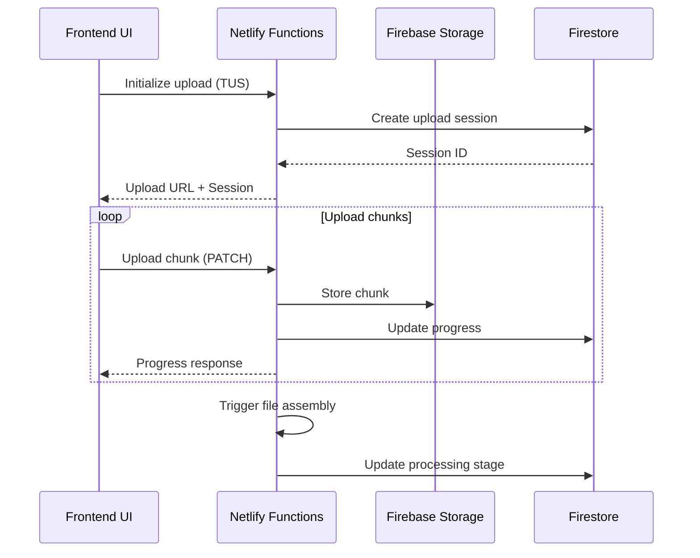
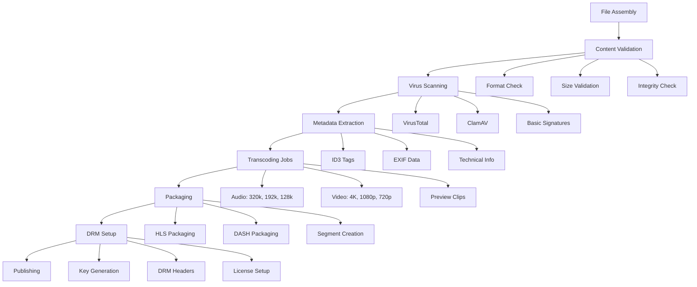
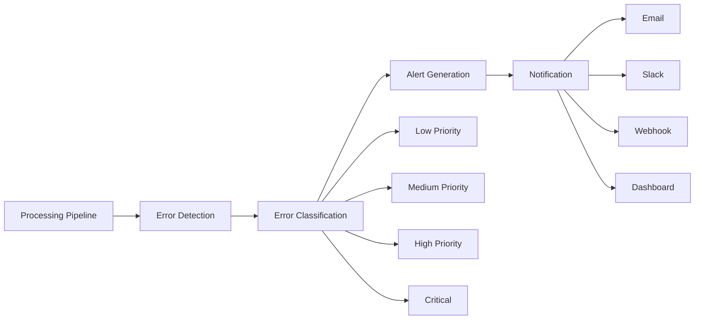

# BeatflowMedia Content Ingestion System Architecture

## Overview

This document provides a comprehensive overview of BeatflowMedia's production-ready content ingestion system designed to handle audio and video content with DRM protection, territorial rights management, and scalable streaming delivery.

## System Architecture

### High-Level Architecture

```
┌─────────────────┐    ┌─────────────────┐    ┌─────────────────┐
│   Frontend UI   │    │  Netlify Edge   │    │ Firebase Cloud  │
│                 │────│   Functions     │────│   Services      │
│ - Upload UI     │    │                 │    │                 │
│ - Dashboard     │    │ - TUS Protocol  │    │ - Firestore     │
│ - Progress      │    │ - Processing    │    │ - Storage       │
│   Tracking      │    │ - Monitoring    │    │ - Functions     │
└─────────────────┘    └─────────────────┘    └─────────────────┘
         │                       │                       │
         │                       │                       │
         ▼                       ▼                       ▼
┌─────────────────┐    ┌─────────────────┐    ┌─────────────────┐
│   CDN/Storage   │    │   Third-Party   │    │   Monitoring    │
│                 │    │    Services     │    │                 │
│ - HLS/DASH      │    │                 │    │ - Error Logs    │
│ - Encrypted     │    │ - VirusTotal    │    │ - Metrics       │
│   Content       │    │ - ClamAV        │    │ - Alerts        │
│ - Thumbnails    │    │ - Transcoding   │    │ - Health Checks │
└─────────────────┘    └─────────────────┘    └─────────────────┘
```

### Component Architecture

#### 1. Upload Layer
- **TUS Protocol**: Resumable uploads with chunk-based delivery
- **Client-side validation**: Format, size, and metadata validation
- **Progress tracking**: Real-time upload progress with pause/resume
- **Drag-and-drop interface**: Modern file selection experience

#### 2. Processing Pipeline
- **File assembly**: Reconstruct files from uploaded chunks
- **Content validation**: Format verification and integrity checks
- **Virus scanning**: Multi-provider security scanning
- **Metadata extraction**: Automatic technical metadata extraction
- **Transcoding**: Multi-quality audio/video transcoding
- **Packaging**: HLS/DASH packaging with DRM encryption
- **Asset generation**: Thumbnails, waveforms, and previews

#### 3. Storage and Delivery
- **Firebase Storage**: Secure cloud storage with CDN integration
- **DRM Protection**: Widevine, PlayReady, and FairPlay support
- **Adaptive streaming**: HLS and DASH with multiple bitrates
- **Geographic distribution**: Multi-region content delivery

#### 4. Rights Management
- **Territorial rights**: Country/region-specific licensing
- **Usage tracking**: Play counts and revenue analytics
- **Copyright protection**: Content fingerprinting and claim management
- **Licensing workflow**: Commercial and editorial use permissions

## Data Flow

### 1. Upload Process



### 2. Content Processing Pipeline



### 3. Monitoring and Error Handling



## API Endpoints

### Content Ingestion Functions

| Endpoint | Method | Description |
|----------|--------|-------------|
| `/upload-init` | POST | Initialize TUS upload session |
| `/upload-chunk/{id}` | PATCH | Upload file chunk |
| `/assemble-file` | POST | Assemble chunks into complete file |
| `/validate-content` | POST | Validate uploaded content |
| `/virus-scan` | POST | Perform virus scanning |
| `/extract-metadata` | POST | Extract technical metadata |
| `/transcode-content` | POST | Start transcoding pipeline |
| `/package-content` | POST | Create HLS/DASH packages |
| `/monitoring` | GET | System health and metrics |

### Frontend Integration

```javascript
// Example usage of the content ingestion service
import { contentIngestionService } from './services/contentIngestionService';

// Upload with progress tracking
const upload = await contentIngestionService.uploadContent(file, {
  title: 'Song Title',
  artist: 'Artist Name',
  territorialRights: 'worldwide'
});

// Monitor processing
await contentIngestionService.waitForProcessing(
  upload.uploadId,
  (status) => {
    console.log('Processing status:', status);
  }
);
```

## Security Considerations

### 1. Authentication and Authorization
- Firebase Authentication for user management
- Role-based access control (RBAC)
- JWT token validation for API access
- Admin-only access for sensitive operations

### 2. Content Security
- Multi-provider virus scanning
- File format validation and sanitization
- Content fingerprinting for duplicate detection
- Quarantine system for suspicious content

### 3. DRM and Encryption
- CENC (Common Encryption) standard compliance
- Multi-DRM support (Widevine, PlayReady, FairPlay)
- Secure key storage and rotation
- License server integration

### 4. Data Protection
- Encryption at rest and in transit
- GDPR compliance for user data
- Territorial restrictions enforcement
- Secure metadata handling

## Performance Optimization

### 1. Upload Performance
- Chunk-based resumable uploads
- Parallel chunk processing
- Client-side compression
- CDN edge locations for global reach

### 2. Processing Efficiency
- Asynchronous pipeline processing
- Queue-based job management
- Resource allocation optimization
- Auto-scaling based on demand

### 3. Streaming Performance
- Adaptive bitrate streaming
- Multiple CDN regions
- Edge caching strategies
- Bandwidth optimization

## Monitoring and Analytics

### 1. System Metrics
- Upload success rate
- Processing time averages
- Error rates by category
- Storage usage and costs
- Queue depth monitoring

### 2. Content Analytics
- Play counts and engagement
- Geographic distribution
- Quality preference tracking
- Revenue attribution

### 3. Alert System
- Real-time error detection
- Severity-based escalation
- Multi-channel notifications
- Automated resolution triggers

## Scalability Architecture

### 1. Horizontal Scaling
- Serverless functions for auto-scaling
- Database sharding strategies
- CDN distribution
- Load balancing

### 2. Cost Optimization
- Lifecycle policies for storage
- Transcoding optimization
- Caching strategies
- Resource pooling

### 3. Global Distribution
- Multi-region deployment
- Edge computing
- Local compliance requirements
- Latency optimization

## Deployment Strategy

### 1. Environment Setup
```bash
# Install dependencies
npm install

# Configure environment variables
cp .env.example .env

# Deploy Netlify Functions
netlify deploy --prod

# Set up Firebase
firebase deploy
```

### 2. Environment Variables
```bash
# Firebase Configuration
FIREBASE_PROJECT_ID=your-project-id
FIREBASE_PRIVATE_KEY=your-private-key
FIREBASE_CLIENT_EMAIL=your-client-email
FIREBASE_STORAGE_BUCKET=your-storage-bucket

# Virus Scanning APIs
VIRUSTOTAL_API_KEY=your-virustotal-key
CLAMAV_ENDPOINT=your-clamav-endpoint
METADEFENDER_API_KEY=your-metadefender-key

# DRM Configuration
WIDEVINE_LICENSE_SERVER=your-widevine-url
PLAYREADY_LICENSE_SERVER=your-playready-url
FAIRPLAY_CERTIFICATE_URL=your-fairplay-cert-url

# Monitoring and Alerts
SLACK_WEBHOOK_URL=your-slack-webhook
ALERT_EMAIL_WEBHOOK=your-email-service

# Transcoding Services (optional)
TRANSCODING_SERVICE=aws|gcp|builtin
AWS_MEDIACONVERT_ROLE=your-aws-role
GCP_PROJECT_ID=your-gcp-project
```

### 3. Database Setup
```javascript
// Run database initialization
node scripts/initializeDatabase.js

// Set up Firestore indexes
firebase deploy --only firestore:indexes

// Configure security rules
firebase deploy --only firestore:rules
```

## Testing Strategy

### 1. Unit Testing
- Function-level testing
- Validation logic testing
- Error handling verification
- Mock external services

### 2. Integration Testing
- End-to-end upload flow
- Processing pipeline testing
- DRM functionality verification
- Cross-browser compatibility

### 3. Performance Testing
- Load testing with concurrent uploads
- Processing time benchmarks
- Storage performance metrics
- CDN delivery testing

### 4. Security Testing
- Vulnerability scanning
- Penetration testing
- DRM bypass attempts
- Data leakage prevention

## Troubleshooting Guide

### Common Issues

#### 1. Upload Failures
- **Symptom**: Upload stalls or fails
- **Diagnosis**: Check network connectivity, file size limits
- **Resolution**: Implement retry logic, validate file format

#### 2. Processing Delays
- **Symptom**: Content stuck in processing
- **Diagnosis**: Check transcoding queue depth, resource availability
- **Resolution**: Scale processing resources, optimize job priorities

#### 3. DRM Issues
- **Symptom**: Content won't play with DRM
- **Diagnosis**: Verify key generation, license server connectivity
- **Resolution**: Check DRM configuration, validate PSSH boxes

#### 4. Performance Issues
- **Symptom**: Slow upload/processing times
- **Diagnosis**: Monitor system metrics, identify bottlenecks
- **Resolution**: Optimize chunk sizes, scale infrastructure

### Monitoring Commands

```bash
# Check system health
curl /.netlify/functions/content-ingestion/monitoring?action=health

# Get processing metrics
curl /.netlify/functions/content-ingestion/monitoring?action=metrics

# View error logs
curl /.netlify/functions/content-ingestion/monitoring?action=errors&limit=50
```

## Future Enhancements

### 1. AI/ML Integration
- Automated content tagging
- Music genre classification
- Copyright detection
- Quality assessment

### 2. Advanced Analytics
- Predictive analytics for content performance
- User behavior analysis
- Revenue optimization recommendations
- A/B testing for processing parameters

### 3. Enhanced DRM
- Forensic watermarking
- Advanced anti-piracy measures
- Blockchain-based rights tracking
- Smart contract licensing

### 4. Global Expansion
- Additional regional CDNs
- Local content regulations compliance
- Multi-language support
- Currency localization

## Conclusion

This content ingestion system provides a robust, scalable foundation for BeatflowMedia's content management needs. The architecture supports high-volume uploads, secure content processing, and global content delivery while maintaining flexibility for future enhancements.

The system's modular design allows for incremental improvements and easy integration of new technologies as they become available. Regular monitoring and maintenance ensure optimal performance and security for all content operations.

For questions or support, please refer to the API documentation or contact the development team.